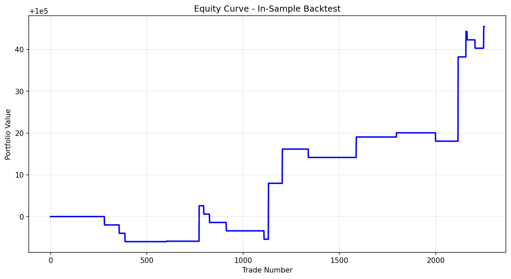
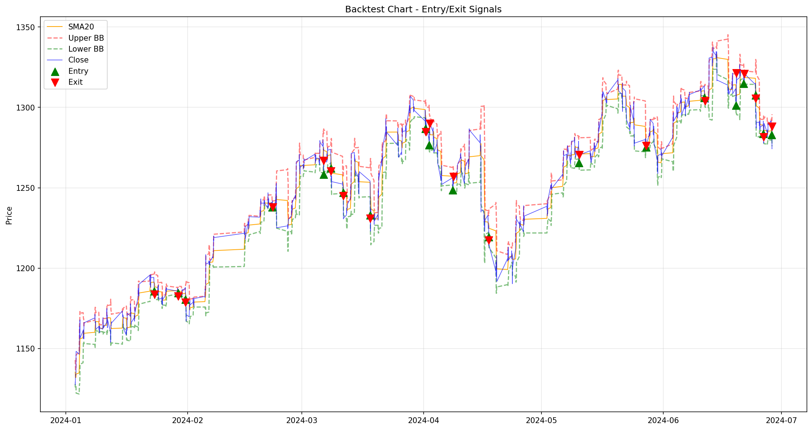

# BBSmaReversion

## Abstract
This project implements a mean reversion trading strategy for VN30 Index Futures (VN30F1M) based on Bollinger Bands and SMA20. The strategy identifies oversold conditions when price touches or crosses below the lower Bollinger Band, expecting price to revert to its mean (SMA20) in the short term.

## Introduction
This project explores the application of mean reversion trading strategies to the VN30 Index Futures market (VN30F1M). Mean reversion strategies operate on the principle that asset prices tend to revert to their historical mean or average over time. When prices deviate significantly from this mean—reaching oversold conditions—they create potential trading opportunities as the market corrects itself.

The system is built with a modular architecture:
- Data loading and processing for VN30F1M futures
- Technical indicator calculation (SMA, Bollinger Bands)
- Signal generation based on band crossovers
- Backtesting engine with precise entry and exit execution
- Performance evaluation using standard financial metrics

## Trading Hypotheses

### Hypothesis
When the price of an asset drops significantly below its moving average—specifically touching or crossing the Lower Bollinger Band—it is considered statistically 'oversold.' We expect the price to revert to its mean (the 20-period SMA) in the short term.

### Target Market
- **Ticker**: VN30F1M
- **Timeframe**: 15-minute (configurable)
- **Strategy Type**: Mean Reversion

## Entry Conditions

### Buy Signal (Long Position)
- Previous price was above the lower Bollinger Band: Pt-1 > LowerBand(t-1)
- Current price crosses to or below the lower band: Pt <= LowerBandt
- This indicates an oversold condition where price has dropped to or below the lower band

## Exit Conditions

### Take-Profit
- Exit when price reaches or exceeds SMA20 (price has returned to the mean)

### Stop-Loss
- Exit when unrealized loss reaches -2 points

### Time-Based Exit
- No positions remain overnight
- If position is still open at ATC session (14:45), close with market order

## Order Execution
- **Position Size**: 1 contract per trade
- **Entry**: Limit Order at current price Pt

---

## Data

### Data Collection

The system retrieves tick-by-tick data for VN30 Index Futures from a PostgreSQL database using the `DataLoader` class.

1. Queries active front-month contract data by joining:
   - `quote.matched` table: price and timestamp data
   - `quote.futurecontractcode` table: contract mapping information
   - `quote.total` table: volume data

2. Database configuration (config/database.json):
```json
{
  "host": "<host or ip>",
  "port": <port>,
  "database": "<database name>",
  "user": "<username>",
  "password": "<password>"
}
```

### Data Processing

The `DataProcessor` class handles the transformation of raw tick data:
1. OHLCV Generation: Converts tick data to configurable timeframe candles
2. Trading Hours Filtering: Restricts data to regular trading hours (09:15-14:45)
3. Technical Indicator Calculation: Adds SMA and Bollinger Bands

## Implementation

### Environment Setup

1. Clone the repository:
```bash
git clone <repository-url>
cd BBSmaReversion
```

2. Create and activate virtual environment:
```bash
python -m venv venv
source venv/bin/activate  # Unix/macOS
# or
venv\Scripts\activate     # Windows
```

3. Install dependencies:
```bash
pip install -r requirements.txt
```

4. Configure database connection:
Create `config/database.json` with your Algotrade PostgreSQL credentials.

### Running the Strategy

#### Using Python Script
```bash
python src/run_backtest.py
```

#### Using Jupyter Notebook
```bash
jupyter notebook notebooks/run_backtest.ipynb
```

### Configuration

Strategy parameters are configured in `config/strategy_config.json`:
```json
{
    "parameters": {
        "bb_window": 20,
        "bb_std": 2.0,
        "sma_window": 20,
        "default_timeframe": "15min",
        "stop_loss_points": 2
    }
}
```

## In-sample Backtesting

### Parameters
Using default configuration:
- Bollinger Bands: 20-period, 2.0 std dev
- SMA: 20-period
- Stop-loss: 2 points

### Results
Period: 2024-01-01 to 2024-06-01 (dummy data for demonstration)

| Metric              | Value      |
|---------------------|------------|
| Total Trades        | [To be filled] |
| Win Rate            | [To be filled] |
| Total Return        | [To be filled] |
| Sharpe Ratio        | [To be filled] |
| Max Drawdown        | [To be filled] |





## Optimization

### Optimization Parameters
- BB Window: 10-50
- BB Std: 1.5-3.0
- SMA Window: 10-50
- Timeframes: 5min, 15min, 30min, 1h

### Process
Using Optuna for parameter optimization (to be implemented)

## Out-of-sample Backtesting

### Parameters
Using optimized parameters from previous step

### Results
Period: 2024-06-01 to 2024-12-01 (to be filled after running)

---

## Conclusion

The BB SMA Reversion strategy provides a systematic approach to trading VN30F1M futures based on mean reversion principles. The strategy aims to capture profits when price reverts to its mean after reaching oversold conditions.

### Key Features:
- Clear entry signal based on Bollinger Bands crossover
- Fixed stop-loss of 2 points
- Take-profit at SMA20 (mean reversion target)
- No overnight positions

### Areas for Improvement:
- Parameter optimization
- Market condition filters
- Adaptive position sizing
