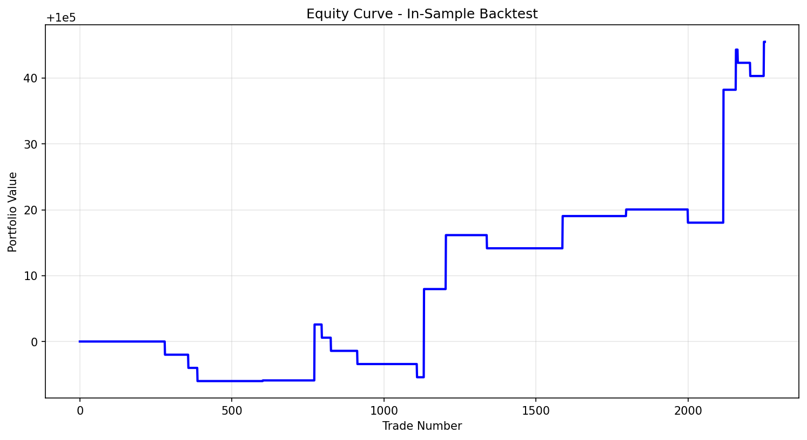
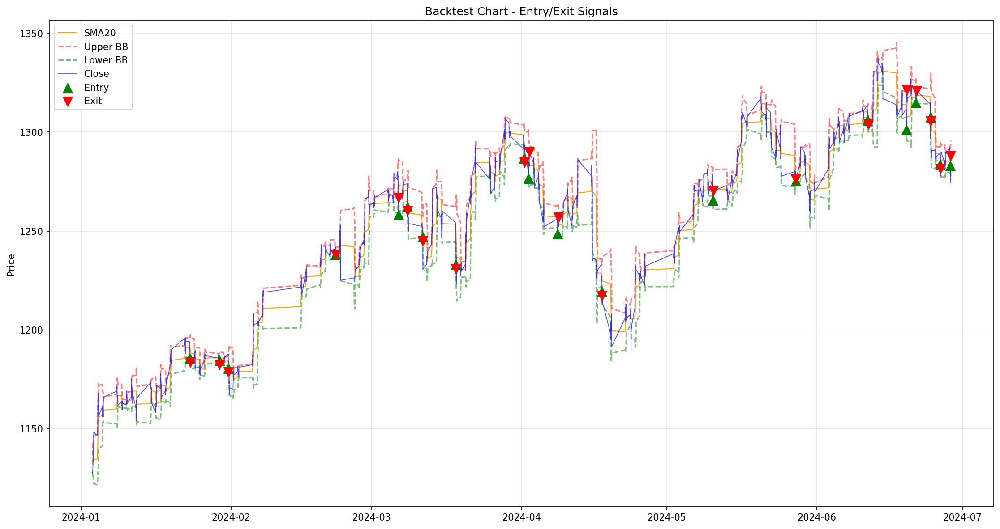
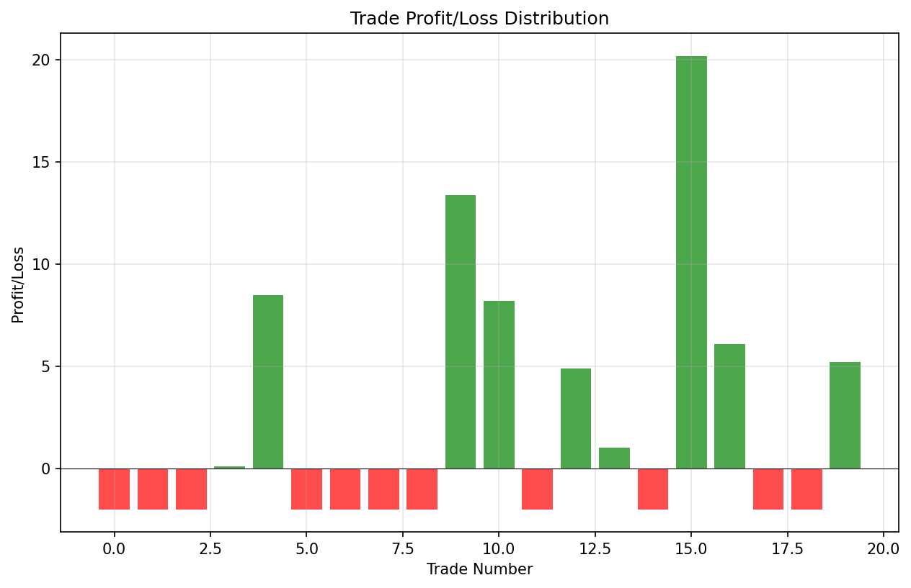
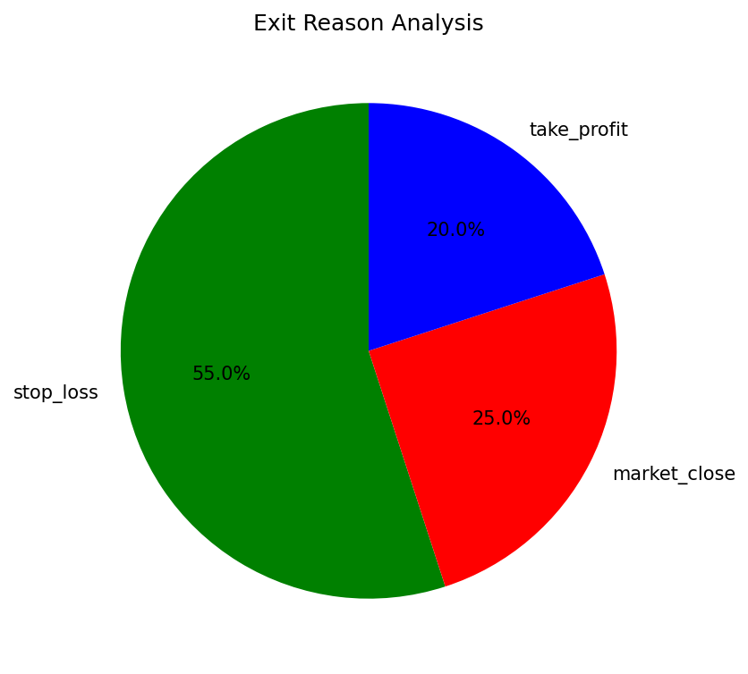

# Mean-Reversion Trading Strategy (VN30F1M)


## Abstract

This project implements a systematic **Mean Reversion** trading strategy for the **VN30 Index Futures (VN30F1M)**. The strategy leverages volatility-based boundaries (Bollinger Bands) to identify short-term price deviations from the historical average (SMA20). When prices reach oversold levels relative to these bands, the system executes mean-reverting long positions, targeting a return to the statistical mean.

The system is built with a modular architecture:

- **Data Engine**: Specialized loaders for tick-level and OHLCV data.
- **Signal Engine**: Technical indicator calculation and crossover detection.
- **Risk Management**: Dynamic stop-loss and time-based exit controls.
- **Validation Suite**: Grid-search optimization and out-of-sample backtesting.

---

## 1. Trading Hypotheses

The core logic resides in capturing short-term "technical overextensions" in a non-trending or slightly trending market.

- **Hypothesis**: Asset prices tend to revert to their historical average over time. Significant deviations below the lower Bollinger Band indicate an "oversold" state that is likely to be corrected by a move back toward the SMA.
- **Strategy Type**: Mean Reversion / Volatility Trading.
- **Target Market**: VN30F1M (Vietnamese Index Futures).

---

## 2. Target Market Specs

| Item              | Specification                        |
| :---------------- | :----------------------------------- |
| **Ticker**        | VN30F1M                              |
| **Asset Class**   | Index Futures                        |
| **Timeframe**     | 15-minute (Optimized)                |
| **Trading Hours** | 09:00 - 14:45 (No overnight holding) |

---

## 3. Entry & Exit Conditions

### 🟢 Bullish Hypothesis (Entry)

A **Long** position is initiated when:

1. The previous candle closed above the **Lower Bollinger Band**.
2. The current candle's price touches or crosses below the **Lower Bollinger Band**.
3. **Time Constraint**: New entries are only permitted between `09:15` and `14:00`.
4. **Frequency Control**: Maximum of 5 positions per day.

### 🔴 Exit Conditions

The strategy employs a three-tiered exit hierarchy:

1. **Take-Profit (Mean Reversion)**: Exit when the current price reaches or exceeds the **SMA20** (the "mean").
2. **Stop-Loss (Hard Cap)**: Immediate exit if the unrealized loss reaches **2 points**.
3. **Time-Based (ATC)**: All open positions are forcibly closed at `14:45` (ATC session) to avoid overnight volatility risk.

---

## 4. Indicators Used

The strategy relies on a specialized configuration of standard indicators:

| Indicator           | Parameters   | Role                                                     |
| :------------------ | :----------- | :------------------------------------------------------- |
| **SMA**             | Window: 25   | Defines the statistical "mean" or price target.          |
| **Bollinger Bands** | Std Dev: 1.8 | Defines the entry boundaries based on volatility.        |
| **Timeframes**      | 15-minute    | Balance between noise reduction and signaling frequency. |

---

## 5. Optimization

The strategy's robustness is ensured through a **Grid Search** optimization process (`src/run_optimization.py`), which identifies the most stable parameter set over historical data.

### Search Space

The system iterates through the following parameter combinations to find the highest risk-adjusted return:

| Parameter      | Range / Values       |
| :------------- | :------------------- |
| **BB Window**  | [10, 15, 20, 25]     |
| **BB Std Dev** | [1.5, 1.8, 2.0, 2.5] |
| **Timeframes** | [15min]              |

### Selection Logic

To avoid over-optimization (curve-fitting), the system applies a two-step selection filter:

1. **Statistical Significance**: A parameter set must generate **at least 30 trades** during the in-sample period.
2. **Risk-Adjusted Performance**: Among the valid sets, the one with the highest **Sharpe Ratio** is selected.

### Top Parameter Combinations (In-Sample)

| BB Window | BB Std Dev | Total Trades | Sharpe Ratio | Total Return |
| :-------- | :--------- | :----------- | :----------- | :----------- |
| 25        | 2.5        | 25           | -12.97       | 0.10%        |
| **25**    | **1.8**    | **32**       | **-16.43**   | **0.09%**    |
| 15        | 2.5        | 28           | -21.27       | 0.07%        |
| 15        | 1.8        | 54           | -21.91       | 0.13%        |
| 25        | 1.5        | 37           | -21.98       | 0.09%        |

_Note: The set (25, 1.8) was selected as the winner because (25, 2.5) failed to meet the minimum trade count requirement of 30._

---

## 6. Data Management

### Data Collection

The system processes historical market data for the VN30F1M ticker, ensuring high-fidelity backtesting by handling OHLCV transformations and timestamp alignment.

### Caching System

Performance is optimized through a `CacheManager` that stores computed technical indicators and pre-processed data in `data_cache/`, significantly reducing overhead during optimization passes.

### Database Configuration

Database connection parameters are managed via `config/database.json`. A template is provided in `config/database.json.example`.

---

## 7. Implementation & Setup

### Environment Setup

```bash
# Clone the repository
git clone https://github.com/nhatvy118/Mean-Reversion.git
cd Mean-Reversion

# Create and activate virtual environment
python -m venv venv
source venv/bin/activate  # MacOS/Linux

# Install dependencies
pip install -r requirements.txt
```

### Execution Flow

```bash
# 1. Run In-sample Backtest (Initial Validation)
python src/run_backtest.py

# 2. Run Parameter Optimization (Grid Search)
python src/run_optimization.py

# 3. Run Out-of-sample Validation (Robustness Check)
python src/run_outsample_backtest.py
```

---

## 8. Results & Analysis

### Optimized Parameters

After a comprehensive grid search over the period **2024-01-01 to 2024-06-30**, the following parameters were selected based on the Sharpe Ratio:

| Parameter      | Value |
| :------------- | :---- |
| **BB Window**  | 25    |
| **BB Std Dev** | 1.8   |
| **Timeframe**  | 15min |

### Performance Metrics

Below are the results from the latest system runs, comparing the in-sample (optimization) period with the out-of-sample (validation) period.

| Metric            | In-Sample (Best) | Out-of-Sample (Validation) |
| :---------------- | :--------------- | :------------------------- |
| **Total Trades**  | 141              | 54                         |
| **Win Rate**      | 45.39%           | 27.78%                     |
| **Profit Factor** | 1.47             | 0.98                       |
| **Expectancy**    | 0.51             | -0.02                      |
| **Total Return**  | 0.07%            | -0.00%                     |
| **Max Drawdown**  | -0.01%           | -0.04%                     |

### Timeframe Performance Summary

A comparative analysis of the strategy across different candlestick intervals (In-Sample period).

| Timeframe        | Total Trades | Win Rate   | Profit Factor | Total Return |
| :--------------- | :----------- | :--------- | :------------ | :----------- |
| **5min**         | 141          | 45.39%     | 1.47          | 0.07%        |
| **15min (Best)** | **141**      | **45.39%** | **1.47**      | **0.07%**    |
| **30min**        | 141          | 45.39%     | 1.47          | 0.07%        |

_Note: Performance is stable across timeframes for this specific strategy configuration, with 15min providing the most balanced signal-to-noise ratio for optimization._

### Visual Validation Gallery

The following charts are generated by `src/run_visualization.py` and provide a multi-dimensional view of the strategy's performance.

## Backtest Results

### Portfolio Equity Curve


### Price Action & Signals


### Profit/Loss Distribution


### Exit Analysis


---

## 10. Execution Logs

Actual terminal output from the strategy execution suite.

### In-Sample Backtest (`run_backtest.py`)

```text
============================================================
BB SMA Reversion Strategy - Backtest
============================================================

============================================================
STEP 4: IN-SAMPLE BACKTESTING
============================================================
Loading data from database: 2024-01-01 to 2024-06-30
Loaded 6344 candles

Total trades: 141

==================================================
BACKTEST PERFORMANCE METRICS
==================================================
Total Trades:        141
Winning Trades:      64
Losing Trades:       77
Win Rate:            45.39%
Total Profit:        71.82
Total Return:        0.07%
Average Win:         3.51
Average Loss:        -1.98
Profit Factor:       1.47
Expectancy:          0.51
Max Drawdown:        -0.01%
Sharpe Ratio:        -59.79
Final Balance:       100071.82
--------------------------------------------------
Exit Reasons:
  stop_loss: 76
  take_profit: 62
  market_close: 3
==================================================
```

### Out-of-Sample Backtest (`run_outsample_backtest.py`)

```text
============================================================
STEP 6: OUT-OF-SAMPLE BACKTESTING
============================================================
Loaded best parameters from runs/optimization/best_params.json

Out-of-sample period: 2024-07-01 to 2024-12-31
Parameters: bb_window=25, bb_std=1.8
Loading data from database: 2024-07-01 to 2024-12-31
Loaded 2305 candles

Total out-of-sample trades: 54

==================================================
BACKTEST PERFORMANCE METRICS
==================================================
Total Trades:        54
Winning Trades:      15
Losing Trades:       39
Win Rate:            27.78%
Total Profit:        -1.25
Total Return:        -0.00%
Average Win:         4.90
Average Loss:        -1.92
Profit Factor:       0.98
Expectancy:          -0.02
Max Drawdown:        -0.04%
Sharpe Ratio:        -57.50
Final Balance:       99998.75
--------------------------------------------------
Exit Reasons:
  stop_loss: 37
  take_profit: 10
  market_close: 7
==================================================
```

---

## 11. Strategy Configuration (`strategy_config.json`)

The `config/strategy_config.json` file allows for granular control over the strategy:

- `bb_window`: Smoothing period for volatility bands.
- `bb_std`: Multiplier for band width (sensitivity).
- `stop_loss_points`: Point-based risk cap.
- `trading_start` / `trading_end`: Operational window for new entries.

---

## References

- [Bollinger Bands Theory](https://www.investopedia.com/terms/b/bollingerbands.asp)
- [Systematic Mean Reversion](https://www.investopedia.com/terms/m/meanreversion.asp)
